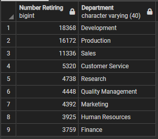

# Pewlett Hackard Analysis
## Overview of the analysis
As Baby Boomers near retirement, a tsunami of retirements, could place Pewlett Hackard in a precarious situation where talent and corporate knowledge could be lost forever. Therefore, a proactive analysis to determine the size and scope of the upcoming retirement wave is performed here.

The following questions are answered in this analysis:

* How many people will potentially retire?
* Number of expected retirements by title.
* Number of potential mentors that could train new hires to ensure business continuity.

## Results
The key findings of the analysis:
* The total number of potential retirees is **72,458**.
* The number of potential mentors is **1,549**.
* Assuming that every retiree must be replaced, then **47** new hires must be assigned to a mentor.
* Titles of greatest focus are senior engineer and staff and genearal engineer and staff.

## Summary

As noted in the results, **72,458** employees will retire soon. Given the number of current employees is **240,124**, about 30% of the workforce will be lost. This is rougly 1 in 3 of the current staff and should be treated as a serious issue.

Currently, **47** new employees would need to be assigned to each mentor. This would be unsustainable. 

Breaking down the "Silver tsunami" by departments does not imporve the mentor to mentee ratios. In some departments the ratio is higher than **50**!

Possible solutions include:
* Expanding the number of candidate mentors
* Reviewing if all retiring positions need to be replaced. Some positions / projects could be phased out.